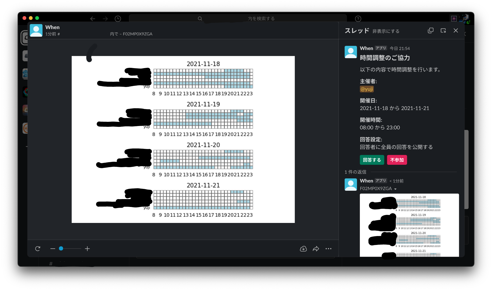

# When

日程調整用の Slack アプリ。



詳細は [wiki](https://github.com/yuji96/slack-app-when/wiki) を参照してください。

## setup (for Mac)
```zsh
$ pip install pipenv
$ pipenv sync --dev
```
### vscode の設定
vscodeでワークスペースを開いたときに自動でpipenv環境に入るようにするための
設定．
1. pipenvのpythonのパスを取得する．
```zsh
$ pipenv shell
$ which python
~/.local/share/virtualenvs/<your-python-path>/bin/python
```
2. vscodeの設定ファイルを作成する．
```zsh
$ touch .vscode/settings.json
```
3. `settings.json`にpythonのパスを設定する．
```json
"python.pythonPath": "~/.local/share/virtualenvs/<your-python-path>/bin/python",
```

## run
[`ngrok`](https://ngrok.com/download)をダウンロード後に，`ngrok`を`/usr/local/bin/`に移動する．

```zsh
pipenv run server
python src/app.py
```
`ngrok`は毎回ランダムなURLを発行するので、その都度 Slack App の設定を更新しないといけない．

## contribute
- Slackでは1つのアプリに1つのRequest URL しか設定できないため，開発用アプリを個人でそれぞれ `manufest.json` から作成する．
- 各アプリでスコープを一致させる必要があるため，新機能のPRを出すときは最新の `manifest.json` も出す．（`null`の部分は変更しない．）
- `manifest.json` があっても設定は自動更新されないので，PRで変更されたら各個人で `manifest.json` が一致するようにアプリ設定画面を手動で編集する．
